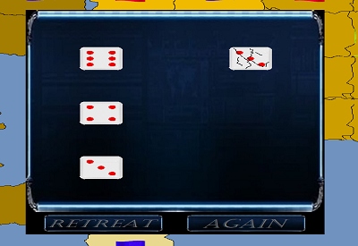

# RiskGame

The object of Risk is to control all 29 territories of the world.Territories are claimed at the beginning of the game. On your turn,you can reinforce your territories,attack neighboring territories and fortify many territory for strategic purposes. 

You need at least 2 Players(Generals) to play the game, all of them must be a human General. Create your own to play against other people at the this computer. The order in which you select the Generals will be the order they appear in the game.  

With **Random Deal**, the computer assign lands to each player. Then, each player claims one land at a time by placing a soldier on its land. Once all lands are claimed, players reinforce their lands with any remaining soldiers and awarding soldiers. 

At the start of each turn, you are awarded the following soldiers to reinforce your armies:
1. soldier for every 3 lands you control.
1. Bonus soldiers for each continent you control. 

Choose a land with 2 or more soldiers to attack an enemy in an adjacent land. Lands are adjacent if they share a border, or a sea-line runs between them. You may attack with up to 3 soldiers, but defend with a maximum of 2 soldiers.Roll the dice and compare your highest dice with your opponents to see who won. Ties are awarded to the defender. 

You may end an attack at any time by pressing the Retreat button, and you may start an attack by pressing the Roll button, then you may click on the Again button for attack again. 

You win the invasion when you defeat the last defending soldier from a land. The soldiers used to win the battle automatically move to the land you invaded.

After you have finished attacking, you get many 'free move' to fortify (or redeploy) soldiers from one land to another. To fortify your position, take as many soldiers as you'd like from one of your as land and move them to a connected land.Lands are connected if all the lands in between are also controlled by you. You must leave at least one soldier behind-you cannot abandon a land. 

Eliminate other players by defeating their last remaining land.
